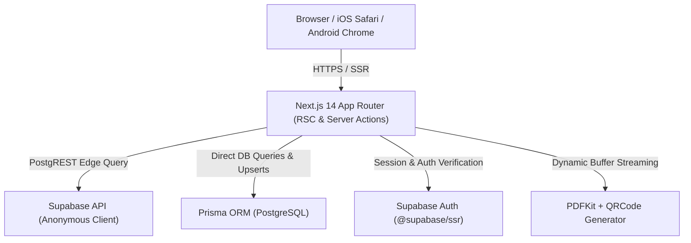

# 🎨 SkillItLearn — Design System & Technical Architecture Guide

> **Official Design & Technical Blueprint**  
> Last Updated: August 2026 | Version: 2.4.0

---

## 📑 Table of Contents
1. [Executive Overview](#1-executive-overview)
2. [Technology Stack & Architecture](#2-technology-stack--architecture)
3. [Design Tokens & Color Palette](#3-design-tokens--color-palette)
4. [Mobile Sizing & iOS Optimization (6.1" to 6.7")](#4-mobile-sizing--ios-optimization-61-to-67)
5. [Multi-Layer Fallback Architecture](#5-multi-layer-fallback-architecture)
6. [Database Schema & Data Access Layer (DAL)](#6-database-schema--data-access-layer-dal)
7. [Student Journey Flow & Edge-Case Protection](#7-student-journey-flow--edge-case-protection)

---

## 1. Executive Overview

SkillItLearn is a high-performance, web application engineered to deliver structured career learning paths, skill booklets, competency quizzes, and verifiable PDF certificates.

### Key Operational Constraints:
- **Zero-Downtime Resilience**: Every student touchpoint (Auth, Progress Tracking, Quizzes, Certificate Generation, Account Deletion) is backed by multi-layer fallback mechanisms.
- **Mobile-First Excellence**: Sized and tested specifically for 6.1" to 6.7" iOS and Android smartphone viewports (iPhone 13/14/15/16 series, Galaxy S series).
- **Default Theme Policy**: Universal Light Mode by default across all devices, with an accessible dark mode toggle.

---

## 2. Technology Stack & Architecture



- **Frontend / Framework**: Next.js 14 (App Router, Server Components, Client Hooks, Server Actions)
- **Styling**: Vanilla CSS Variables (`globals.css`) + Tailwind CSS (`tailwind.config.ts`)
- **Database**: PostgreSQL hosted on Supabase (`aws-0-ap-south-1`)
- **ORM & Data Layer**: Prisma ORM + `@supabase/supabase-js` PostgREST client (`src/lib/dal/index.ts`)
- **Document Generation**: `pdfkit` + `qrcode` with Base64 Data URL streaming fallback

---

## 3. Design Tokens & Color Palette

### Color System
```css
:root {
  /* Surfaces */
  --bg-surface: #ffffff;
  --bg-surface-raised: #f5f5f5;
  --bg-surface-overlay: #ffffff;

  /* Text */
  --text-primary: #1f2937;
  --text-secondary: #4b5563;
  --text-muted: #9ca3af;

  /* Brand Accents */
  --accent: #5bbd72;         /* Vibrant Green */
  --accent-hover: #4caf50;   /* Deep Green */
  --accent-light: #a5d6a7;   /* Soft Green */

  /* Header & Navigation */
  --header-bg: #1a1a2e;       /* Deep Navy */
  --header-text: #ffffff;

  /* Borders */
  --border-color: #e5e7ed;
}

[data-theme="dark"] {
  --bg-surface: #141627;
  --bg-surface-raised: #1c1f36;
  --bg-surface-overlay: #242840;

  --text-primary: #e4e5ee;
  --text-secondary: #a5a8c4;
  --text-muted: #6e7399;

  --accent: #66bb6a;
  --accent-hover: #57a05a;
  --accent-light: #1b4332;

  --border-color: #2a2e48;
}
```

---

## 4. Mobile Sizing & iOS Optimization (6.1" to 6.7")

### Responsive Typography Hierarchy
| Element | Mobile (390px - 430px) | Tablet (768px) | Desktop (1024px+) |
|---|---|---|---|
| `h1` (Main Hero / Page Title) | `text-2xl` (24px / 32px) | `text-4xl` (36px) | `text-6xl` (60px) |
| `h2` (Section Headings) | `text-xl` (20px / 28px) | `text-2xl` (24px) | `text-4xl` (36px) |
| `h3` (Card / Track Titles) | `text-lg` (18px / 24px) | `text-xl` (20px) | `text-3xl` (30px) |
| `h4` (Step Titles) | `text-base` (16px / 22px) | `text-lg` (18px) | `text-2xl` (24px) |
| Body Text | `text-sm` (14px / 20px) | `text-base` (16px) | `text-lg` (18px) |
| Badges & Pill Buttons | `px-3.5 py-1.5 text-xs` | `px-5 py-2 text-sm` | `px-6 py-2.5 text-sm` |

### iOS Back Button Mechanics (`src/components/layout/mobile-header-controls.tsx`)
- Detects iOS user agents (`/iPhone|iPad|iPod/i.test(navigator.userAgent)`).
- Renders a glassmorphic `< Back` pill button in the sticky top header on all non-homepage routes (`pathname !== "/"`).
- Triggers `window.history.back()` or falls back to `/`, ensuring iOS Safari and PWA users never get trapped without navigation options.

---

## 5. Multi-Layer Fallback Architecture

### Auth Session Persistence (`auth/actions.ts`)
```
[User Request] 
      │
      ▼
[Supabase Auth Session Check]
      │
      ├── (DB Online) ──> Fetch User via Prisma ORM ──> Return Full Profile
      │
      └── (DB Offline / Latency) ──> Fallback to Metadata ──> Return Minimal Profile (User stays logged in)
```

### Step Progress Tracking ("Mark Done")
1. **Layer 1 (Instant Auth Metadata)**: Saves step ID to Supabase `user_metadata.completed_step_ids`.
2. **Layer 2 (DB Upsert)**: Upserts row to Prisma DB `learner_progress`.
3. **Layer 3 (Server Component Merge)**: Combines step IDs from both metadata and Prisma using a `Set` union, followed by `router.refresh()`.

### Quiz Grading & Questions Fallback
1. **Primary**: PostgREST fast-fetch from `quiz_questions`.
2. **Fallback**: If PostgREST returns 0 questions or column differences occur (`options` vs `choices_json`), queries questions via Prisma ORM (`prisma.quizQuestion.findMany`).
3. **Completion Update**: On quiz pass (≥10/15), sets **both** `quizPassed: true` AND `stepsCompleted: true` on `SkillCompletion`.

### Certificate Issuance & Download
1. **Signatory Fallback**: If no custom admin template exists for a learning path, defaults to `Ayan Mathur` (`Founder & Director, SkillItLearn`).
2. **PDF Storage Fallback**: If Supabase Storage upload or URL signing fails, generates a Base64 PDF Data Stream on the fly.
3. **DOM Download Trigger**: `download-client.tsx` triggers Base64 Data URL downloads via a programmatic DOM anchor (`<a download>`), bypassing pop-up blockers in Chrome, Safari, and Firefox.

---

## 6. Database Schema & Data Access Layer (DAL)

### Database Models (Prisma `schema.prisma`)
- `User` (`users`) — UUID, email, fullName, role (`learner`, `instructor`, `admin`, `super_admin`).
- `Career` (`careers`) — slug, name, description, iconUrl.
- `Path` (`career_paths`) — careerId, name, slug, description, orderIndex.
- `Skill` (`skills`) — pathId, name, slug, description, estimatedHours, orderIndex.
- `Track` (`modules`) — skillId, title, orderIndex. (Title dynamically masked to "Track").
- `Step` (`steps`) — trackId, title, content, mediaUrls, orderIndex.
- `LearnerProgress` (`learner_progress`) — userId, stepId, completedAt.
- `QuizQuestion` (`quiz_questions`) — skillId, questionText, choicesJson, correctChoiceId, explanation.
- `QuizAttempt` (`quiz_attempts`) — userId, skillId, score, passed, answersJson.
- `SkillCompletion` (`skill_completion`) — userId, skillId, stepsCompleted, quizPassed.
- `Certificate` (`certificates`) — uniqueCertificateId, userId, pathId, verificationHash, pdfUrl.

---

## 7. Student Journey Flow & Edge-Case Protection

1. **Signup & Verification**: Manual signup enforces email OTP verification. Google OAuth auto-provisions user rows via `auth/callback/route.ts`.
2. **Career Navigation**: Public routes use lightweight DAL queries (`src/lib/dal/index.ts`) for zero cold starts.
3. **Booklet Learning**: Track 1 is free preview; Tracks 2+ show green box lock icon for anonymous visitors.
4. **Quiz Evaluation**: 15 questions (5 Easy, 5 Moderate, 5 Difficult). Correct answers stay strictly on the server side.
5. **Certificate Claim & Verification**: Public verification page `/verify/[certificate_id]` recomputes HMAC signature without exposing user email or internal database IDs.
